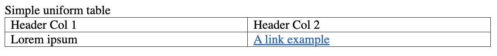
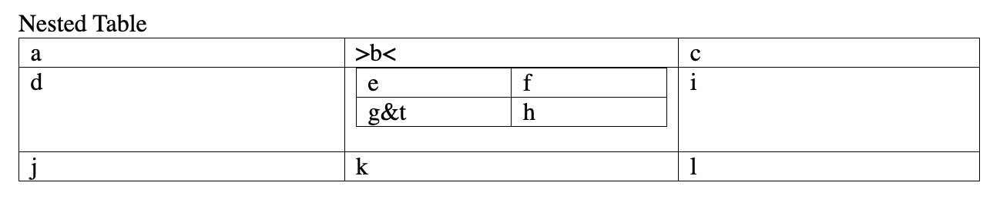
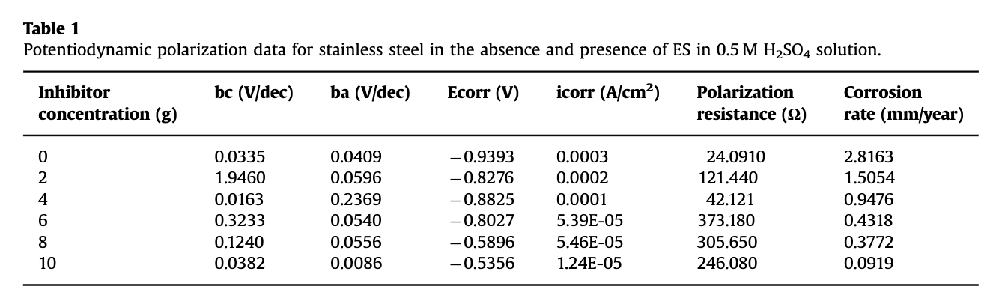
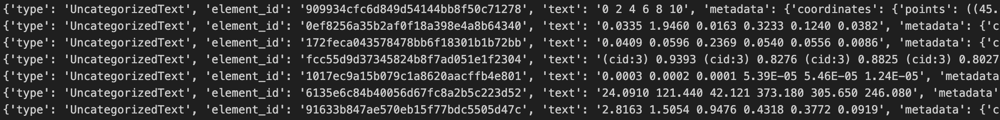

# NOTES

## Transformation of files to json
- This is being done here using unstructured.io python library.

### docx (simple) to json

- tried with [this file](example-docs/category-level.docx)
- conversion of docx to json is accurate
- there is minimal errors here
- but simple docx can be given to LLM as is it as it structured
- the complexity of docx can increase with images, tables etc. which can distort the structure.
- need more experiments on real world data [TODO]

### docx (with pictures) to json

- tried with [this file](example-docs/contains-pictures.docx) 
- conversion of docx to json is accurate
- there is minimal errors here
- need more experiments on real world data [TODO]

### docx (with table) to json

- tried with [this file](example-docs/docx-tables.docx) 
- one of sample of table field in json is:
    ```python
    {
        'type': 'Table', 
        'element_id': 'd7fa9300ff009d00826ee1b6ef34d1f9', 
        'text': 'Header Col 1 Header Col 2 Lorem ipsum A link example', 
        'metadata': 
        {
            'file_directory': 'example-docs', 
            'filename': 'docx-tables.docx', 
            'last_modified': '2024-07-18T17:16:12', 
            'text_as_html': '<table>\n<thead>\n<tr><th>Header Col 1  </th><th>Header Col 2  </th></tr>\n</thead>\n<tbody>\n<tr><td>Lorem ipsum   </td><td>A link example</td></tr>\n</tbody>\n</table>', 
            'languages': ['eng'], 
            'parent_id': '0e99e8319204527459aad131af47c79b', 
            'filetype': 'application/vnd.openxmlformats-officedocument.wordprocessingml.document'
        }
    }
    ```
- the htm markdown generated is as
    <table>\n<thead>\n<tr><th>Header Col 1  </th><th>Header Col 2  </th></tr>\n</thead>\n<tbody>\n<tr><td>Lorem ipsum   </td><td>A link example</td></tr>\n</tbody>\n</table>

- original table given in the docx was
    
- another example of the table in the same docx generated is as below
    <table>\n<thead>\n<tr><th>a  </th><th>&gt;b&lt;  </th><th>c  </th></tr>\n</thead>\n<tbody>\n<tr><td>d  </td><td><table>\n<tbody>\n<tr><td>e      </td><td>f</td></tr>\n<tr><td>g&amp;t</td><td>h</td></tr>\n</tbody>\n</table>            </td><td>i  </td></tr>\n<tr><td>j  </td><td>k          </td><td>l  </td></tr>\n</tbody>\n</table>
- original table given in the docx was
    
- The table structure is preserved with high accuracy.

### pdf (a paper) to json 

- tried with [this file](example-docs/layout-parser-paper-fast.pdf)
- Here, the vertical side text is also parsed
    - those were categorized as unrecognized
        - one example is below where the year 2021 on the side was vertically written and was parsed as:
        ```python
        {
            'type': 'UncategorizedText', 
            'element_id': '9893d694389eafb8a1e34ada39f8a68b', 
            'text': '1 2 0 2', 
            'metadata': {
                'coordinates': {
                    'points': (
                        (16.34, 213.36), 
                        (16.34, 253.36), 
                        (36.34, 253.36), 
                        (36.34, 213.36)
                    ), 
                    'system': 'PixelSpace', 
                    'layout_width': 612, 
                    'layout_height': 792
                }, 
                'file_directory': 'example-docs', 
                'filename': 'layout-parser-paper-fast.pdf', 
                'languages': ['eng'], 
                'last_modified': '2024-07-18T17: 16: 09', 
                'page_number': 1, 
                'filetype': 'application/pdf'
            }
        }
        ```

    - some of them were wrongly categorized.
        - one example is as below where the vertical text `"V C . s c ["` is wrongly recognized as text:
        ```python
        {
            "type": "Title",
            "element_id": "cc83b80ff167dfafaf496dc21f5004f3",
            "text": "V C . s c [",
            "metadata": {
                "coordinates": {
                    "points": ((16.34, 327.8), (16.34, 383.9), (36.34, 383.9), (36.34, 327.8)),
                    "system": "PixelSpace",
                    "layout_width": 612,
                    "layout_height": 792,
                },
                "file_directory": "example-docs",
                "filename": "layout-parser-paper-fast.pdf",
                "languages": ["eng"],
                "last_modified": "2024-07-18T17:16:09",
                "page_number": 1,
                "filetype": "application/pdf",
            },
        }
        ```
- we can develop a method to remove these unnecessary text and improve the quality of the content
- they carry unnecessary data with them
- the coordinates given in the metadata will help LLM to recognize that it is actually a vertical text (?)

### pdf (with pictures) to json

- tried with [this file](example-docs/embedded-images-tables.pdf)
- the example contained images (graphs) and table
- based on a scientific paper
- some parts were wrongly identified as a `Title` element
- one of such example was
```python
{
    "type": "Title",
    "element_id": "52371c5cced83673eca4d2474137527b",
    "text": "bc (V/dec)",
    "metadata": {
        "coordinates": {
            "points": (
                (116.22059424, 283.309816),
                (116.22059424, 289.685816),
                (147.68639256, 289.685816),
                (147.68639256, 283.309816),
            ),
            "system": "PixelSpace",
            "layout_width": 467.716,
            "layout_height": 680.315,
        },
        "file_directory": "example-docs",
        "filename": "embedded-images-tables.pdf",
        "languages": ["eng"],
        "last_modified": "2024-07-18T17:16:13",
        "page_number": 1,
        "parent_id": "e3628b22524bc39b4c416b2ba3277dc3",
        "filetype": "application/pdf",
    },
}
```
- Also, it failed to recognize the table given in the sample which is as below:

- the conversion of the above table to the json is as follows, where it is categorized as `UncategorizedText` element instead of `Table` element:

- need more experiments with more real world examples [TODO]

### html to json

- tried with [this file](example-docs/example-10k.html)
- the HTML was accurately converted to json
- it removed unnecessary information such as style etc.

### image (of text) to json

- tried with [this file](example-docs/DA-1p.jpg)
- The image is very plane and simple to capture of medium quality
- All the text is captured almost accurately
- The main title in this image is not parsed, apparently because it was underlined.
- Parsing image will become difficult as the image gets complex or of lower quality
- Factors like highly styled text, lighting, etc. will effect parsing greatly.

### CSV (with escaped columns) to json

- tried with [this file](example-docs/csv-with-escaped-commas.csv)
- here, there were commas in the content of the table
- the csv file json generation is as follows:
```python
{
    "type": "Table",
    "element_id": "afca32b980573cd0f8671aac54a34cfb",
    "text": "\n\n\nA\nA\nA\nA\nA\n\n\nA\nA\nA\nA,A\nA\n\n\nA\nA\nA\nA,A\nA\n\n\n",
    "metadata": {
        "file_directory": "example-docs",
        "filename": "csv-with-escaped-commas.csv",
        "last_modified": "2024-07-19T10:33:00",
        "text_as_html": '<table border="1" class="dataframe">\n  <tbody>\n    <tr>\n      <td>A</td>\n      <td>A</td>\n      <td>A</td>\n      <td>A</td>\n      <td>A</td>\n    </tr>\n    <tr>\n      <td>A</td>\n      <td>A</td>\n      <td>A</td>\n      <td>A,A</td>\n      <td>A</td>\n    </tr>\n    <tr>\n      <td>A</td>\n      <td>A</td>\n      <td>A</td>\n      <td>A,A</td>\n      <td>A</td>\n    </tr>\n  </tbody>\n</table>',
        "languages": ["hun"],
        "filetype": "text/csv",
    },
}
```
- the original csv file was as below:
```
A,A,A,A,A
A,A,A,"A,A",A
A,A,A,"A,A",A
```
- the table markdown generated is rendered as below:
- the structure of the table is well preserved.
<table border="1" class="dataframe">\n  <tbody>\n    <tr>\n      <td>A</td>\n      <td>A</td>\n      <td>A</td>\n      <td>A</td>\n      <td>A</td>\n    </tr>\n    <tr>\n      <td>A</td>\n      <td>A</td>\n      <td>A</td>\n      <td>A,A</td>\n      <td>A</td>\n    </tr>\n    <tr>\n      <td>A</td>\n      <td>A</td>\n      <td>A</td>\n      <td>A,A</td>\n      <td>A</td>\n    </tr>\n  </tbody>\n</table>

### CSV (with long lines) to json

- tried with [this file](example-docs/csv-with-long-lines.csv)
- the json generation is also accurate in this case.

### xlsx to json

- tried with [this file](example-docs/emoji.xlsx)
- the original table was as below:

- the json generated for this was
```python
{
    "type": "UncategorizedText",
    "element_id": "860fbd53276a162758fcad2991d70401",
    "text": "🤠😅",
    "metadata": {
        "file_directory": "example-docs",
        "filename": "emoji.xlsx",
        "last_modified": "2024-07-19T10:33:01",
        "page_name": "Sheet1",
        "page_number": 1,
        "filetype": "application/vnd.openxmlformats-officedocument.spreadsheetml.sheet",
    },
}
```
- there, it didn't recognized it as a `Table` element
- need to explore again with real world examples [TODO] 

### txt to json

- tried with [this file](example-docs/book-war-and-peace-1p.txt)
- here, the categorization of the elements is accurate.

### XML to json

- tried with [this file](example-docs/factbook.xml)
- extra details such as tags were removed.
- all elements in this case were categorized as `Title` element.
- one example of the generated json element is as below:
```python
{
    "type": "Title",
    "element_id": "ee1ead1a7749d7ce87fc152b1ddac99c",
    "text": "Joe Biden",
    "metadata": {
        "file_directory": "example-docs",
        "filename": "factbook.xml",
        "last_modified": "2024-07-19T10:33:01",
        "languages": ["eng"],
        "filetype": "application/xml",
    },
}
```
- the original part of this generated json is as below:
```xml
<?xml version="1.0" encoding="UTF-8"?>
<factbook>
  <country>
    <name>United States</name>
    <capital>Washington, DC</capital>
    <leader>Joe Biden</leader>
    <sport>Baseball</sport>
```
- here, th LLM can understand that the `Joe Biden` is a `<leader>` and not a `Title`
- in this case, the removal of the xml tags is a disadvantage.
- less relevant information is available
- will the situation be same with HTML also?

### pptx (multi page) to json

- tried with [this file](example-docs/fake-power-point-many-pages.pptx)
- here, the ppt was multi-page
- it was converted to json format accurately
- need to experiment with real world ppt examples [TODO]

### miscellaneous to json

- additional experiment of different file types like
    - python
    - json
    - yaml

#### .py
- tried with [this file](example-docs/logger.py)
- the .py file was also categorized int elements like `Title`, `NarrativeText` etc.
- this format for python is not suitable.

#### .json
- tried with [this file](example-docs/simple.json)
- here, the json file is also being converted into json elements
- then again, not suitable as the json information from the original one is missing

#### .yaml
- tried with [this file](example-docs/simple.yaml)
- here, most of the items is categorized as `Title` or `ListItem`
- can be used in case of .yaml for categorization, but not much effective.

- need to device own method or different tool for parsing of code files.

###  PDF to json (using `hi_res` strategy)
- tried with [this file](example-docs/embedded-images-tables.pdf)
- here, we are extracting images and tables
- conversion is very accurate
- images and tables are being stored
- highly effective for PDFs
